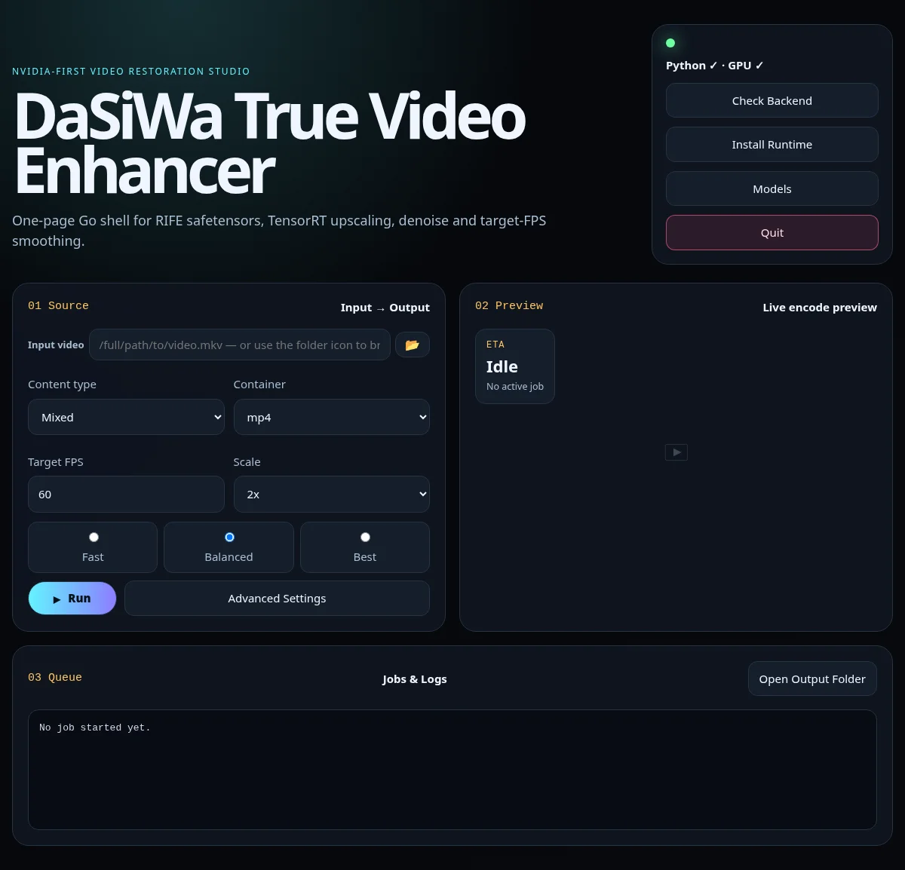

# DaSiWa True Video Enhancer

<div align="center">

[](https://github.com/darksidewalker/TrueVideoEnhancer/stargazers)
[](https://github.com/darksidewalker/TrueVideoEnhancer/watchers)
[](https://github.com/darksidewalker/TrueVideoEnhancer/fork)

</div>

<div align="center">

[](https://en.wikipedia.org/wiki/Linux)
[](https://developer.nvidia.com/cuda-toolkit)
[](https://www.python.org/downloads/release/python-3120/)
[](https://go.dev/)

</div>

<div align="center">
<small>AMD / Intel / Apple Silicon / CPU-only inference are not supported — see the <a href="#support-matrix">support matrix</a>.</small>
</div>

A local, NVIDIA-first video upscaling and frame-interpolation application. The Go server provides a browser UI; a uv-managed Python runtime runs the AI and FFmpeg pipeline.

It is designed for one video job at a time: select a local source, choose a target scale/FPS, and write a new encoded file. Nothing is uploaded.



**Contents**

- [What it does](#what-it-does)
- [Requirements](#requirements)
- [Getting started](#getting-started)
- [Using the app](#using-the-app)
- [Configuration](#configuration)
- [Support matrix](#support-matrix)
- [Model selection](#model-selection)
- [Safe 4x operation](#safe-4x-operation)
- [Encoding and media tracks](#encoding-and-media-tracks)
- [Changelog](#changelog)
- [Credits](#credits)
- [Development checks](#development-checks)

## What it does

- AI video upscaling with bundled/downloadable Safetensors and ONNX models.
- True 2x→4x processing: a native 2x model runs twice; the second pass is not a normal resize.
- RIFE v4.26 frame interpolation for an arbitrary higher target FPS, including fractional conversions such as 24→60.
- Bounded FFmpeg rawvideo decode → AI → encode streaming. It does not write a full PNG frame sequence.
- TensorRT acceleration for CUDA upscalers, with tiled fallback when a full-frame engine cannot compile.
- Local file browsing/search, runtime install/health checks, model downloads, live JPEG progress previews, output preview generation, and job cancellation.
- Container-aware FFmpeg encoding with optional audio/subtitle copying or transcoding.

For architecture, model routing, limits, and encoder behavior, see [docs/TECHNICAL_GUIDE.md](docs/TECHNICAL_GUIDE.md).

## Requirements

The supported inference runtime is NVIDIA CUDA on Linux:

- NVIDIA GPU and working driver (`nvidia-smi`)
- FFmpeg and FFprobe available on `PATH`
- Network access on first runtime/model installation
- Disk space for the uv Python environment, models, TensorRT cache, and output video

The app installs Python 3.12 (falls back to 3.11) and the project-pinned CUDA 13.2 PyTorch/TensorRT dependencies through `uv`. A CUDA-capable NVIDIA system is required for the shipped runtime; the Go web server itself is portable, but AMD, Intel, Apple Silicon, and CPU-only inference are not supported configurations.

## Getting started

Clone and build the Go binary, then start it:

```bash
git clone https://github.com/darksidewalker/TrueVideoEnhancer.git
cd TrueVideoEnhancer
go build -o dasiwa-true-video-enhancer ./cmd/dasiwa-true-video-enhancer
./dasiwa-true-video-enhancer
```

Open `http://127.0.0.1:8612` in your browser. The first run installs the
Python runtime and models on demand — see [Using the app](#using-the-app)
for the in-app steps, and [Configuration](#configuration) for the
environment variables that control port, browser launch, and the TensorRT
upscaler cache.

## Using the app

The app works one video at a time. On first use:

1. Open **Runtime** and install or check the runtime. This downloads Python
   3.12 and the pinned CUDA 13.2 PyTorch/TensorRT packages into the
   portable `runtime/venv/`.
2. Open **Models** and download any model your job needs. Built-in models
   are pre-listed; see [Model selection](#model-selection).
3. In the main form, pick a local input file, content type, scale, target
   FPS, and output path.
4. Click **Run**. Progress, the current processed frame, and a live log
   appear in the job panel. Cancel any time.

The app reads local files directly — it never uploads video. After a job
finishes, a 20-second 480px-wide MP4 proxy preview is generated for the
browser.

## Configuration

All settings are environment variables read at startup; no config file.

| Variable | Default | Effect |
|---|---|---|
| `DASIWA_PORT` | `8612` | Port the web UI listens on. |
| `DASIWA_NO_BROWSER` | *(unset)* | Set to `1` to stop the automatic browser launch. |
| `RVE_UPSCALER_TRT_ENGINE_CACHE` | `1` (on) | Gate for the persistent TensorRT upscaler engine cache. |
| `FORCE_COLOR` | *(unset)* | Set to `1` to force colored job logs even when piped. |

### `RVE_UPSCALER_TRT_ENGINE_CACHE` — persistent upscaler engine cache

When enabled (the default), compiled TensorRT upscaler engines are written
to `models/.tensorrt-engine-cache/` next to the model file and reused on
the next job, turning a ~39-second compile into a ~16-second cache hit.
Cache entries are safe on `torch_tensorrt` 2.13.0+, which refits cached
engines by rebuilding the weight mapping from the graph.

Set it to a falsy value to fall back to a fresh engine compile per job:

```bash
RVE_UPSCALER_TRT_ENGINE_CACHE=0 ./dasiwa-true-video-enhancer
```

Accepted falsy values: `0`, `false`, `no`, `off` (case-insensitive).
Anything else — including unset — keeps the cache on.

The RIFE frame-interpolation and ONNX upscaler TensorRT caches are
separate, always-on paths and are not affected by this variable.

## Support matrix

| Capability | Status | Notes |
|---|:---:|---|
| NVIDIA CUDA inference | ✅ | PyTorch CUDA; TensorRT is preferred when available. |
| TensorRT Safetensors upscaling | ✅ | Static full-frame or tiled engine; smaller tiles are retried after compile failure. |
| ONNX Runtime / TensorRT upscaling | ✅ | Requires TensorRT Execution Provider to activate; silent CPU fallback is rejected. |
| Safetensors upscalers | ✅ | Loaded through Spandrel; model scale is detected from the descriptor. |
| ONNX upscalers | ✅ | Fixed-shape ONNX models run using their declared input shape. |
| 2x and 4x output | ✅ | A native 2x model selected for 4x runs two real AI passes. |
| Output up to 8K UHD | ✅ | Hard maximum is 33,177,600 output pixels (7680×4320). |
| Output above 8K UHD | ❌ | Rejected before worker start to protect host memory. |
| RIFE v4.26 general interpolation | ✅ | Runs only when target FPS is higher than source FPS. |
| RIFE Heavy / alternate interpolation models | ❌ | Not exposed by the current built-in model list. |
| Arbitrary higher target FPS | ✅ | Timestamp-driven scheduler supports non-integer ratios. |
| AI denoise / restoration-only pipeline | ❌ | No dedicated denoise stage is implemented. |
| HDR processing / tone mapping | ❌ | The UI flag is accepted but the backend has no HDR transform path. |
| Scene detection | ❌ | UI options exist, but no scene-detection branch is executed by the current backend. |
| Batch folder queue | ❌ | Jobs are submitted per input video; there is no folder/batch scheduler. |
| Local file browse and filename search | ✅ | The app reads local paths; it does not upload videos. |
| Job cancel and SSE progress events | ✅ | Cancels the worker context and streams job state/logs. |
| Live processed-frame preview | ✅ | Periodic JPEG preview while a job runs. |
| Post-job browser preview | ✅ | Generates a 20-second, 480px-wide MP4 proxy. |
| MP4, MKV, WebM, MOV, AVI, FLV, TS, M4V output | ✅ | FFmpeg/container compatibility still determines the actual codec. |
| WebM codec safety conversion | ✅ | Incompatible video/audio/subtitle choices are normalized to WebM-safe formats. |
| NVENC H.264 / HEVC / AV1 | ✅ | Used only when the installed FFmpeg and GPU support the encoder. |
| CPU x264/x265, SVT-AV1, VP9, ProRes, FFV1 | ✅ | Availability depends on the local FFmpeg build. |
| AMD / ROCm inference | ❌ | Not implemented. |
| Intel / oneAPI inference | ❌ | Not implemented. |
| Apple Silicon / MPS inference | ❌ | Not a supported shipped runtime. |
| CPU-only inference | ❌ | Not a supported configuration. |

## Model selection

Choose **Auto** for the normal path. The UI selects a built-in model by content type and requested model scale; a manual model selection overrides Auto.

| Content type | Built-in 2x choices | Built-in 4x choices |
|---|---|---|
| Anime | AnimeJaNai Compact; AnimeSharp variants | NomosUni SPAN; HFA2k LUDVAE; optional HAT-L Sharp |
| Mixed | AnimeJaNai Compact; NomosUni SPAN | NomosUni SPAN; UltraSharpV2-Lite |
| Realism | RealPLKSR Restoration; optional RealPLKSR GAN | ClearRealityV1; Nomos WebPhoto; optional HAT-L |

Models are scale-specific. Selecting a native 2x model at a 4x target invokes two AI passes. Selecting a native 4x model invokes one pass. Manual model selection can therefore change both output appearance and memory/throughput behavior.

## Safe 4x operation

4x is much more expensive than 2x: with a 2x model, pass two consumes the first pass's 2x-sized output. The pipeline protects the desktop by rejecting output above 8K UHD, estimating bounded host-memory needs before it starts, and automatically using 256-core tiles (then 128 if compilation fails) for automatic iterative 2x→4x jobs.

A 1080p source at 4x produces 7680×4320 and is within the limit. A 4K source at 4x produces 15360×8640 and is intentionally rejected. Use 2x or a smaller source in that case.

## Encoding and media tracks

The default **Auto** video encoder checks the local FFmpeg build and chooses a container-compatible encoder. Audio and subtitles are copied unless you choose a transcode option. For WebM, incompatible H.264/H.265, AAC/MP3, and subtitle choices are converted before the expensive render begins.

Output codec support is a property of the installed FFmpeg and hardware, not a promise that every encoder is present on every machine.

## Changelog

See [docs/CHANGELOG.md](docs/CHANGELOG.md) for the full release history.
Recent notable changes:

- **2026-08-30** — Fixed the TensorRT upscaler engine-cache refit
  corruption (issue #2) by upgrading the runtime to
  `torch_tensorrt` 2.13.0; the engine cache is now safe and ON by
  default, with `RVE_UPSCALER_TRT_ENGINE_CACHE=0` as the off-switch.
- **2026-08-10** — Sequential job queue with a visible queue UI.
- **2026-07-17** — 4x host-memory guard, persistent TensorRT engine
  cache, bundled AnimeJaNai Compact base upscaler.
- **2026-07-12** — Bounded FFmpeg rawvideo streaming replaces serial PNG
  frame sequences.

## Credits

- **AnimeJaNai HD V3 Compact 2x** — the bundled `2x-AnimeJaNai_HD_V3_Compact.safetensors` model is credited to the [AnimeJaNai project](https://github.com/the-database/AnimeJaNai). It remains subject to its upstream license and terms.
- **[Real-Video-Enhancer](https://github.com/TNTwise/Real-Video-Enhancer)** by TNTwise — a valuable reference project for video-enhancement workflows and model integration. DaSiWa True Video Enhancer is an independent implementation and is not affiliated with or endorsed by Real-Video-Enhancer.

## Development checks

```bash
runtime/venv/bin/python -m pytest backend/tests -q
go test ./...
go build ./cmd/dasiwa-true-video-enhancer
```

The backend source changed between jobs is picked up by the next spawned Python worker. Rebuild the Go binary when Go code or embedded web assets change.
